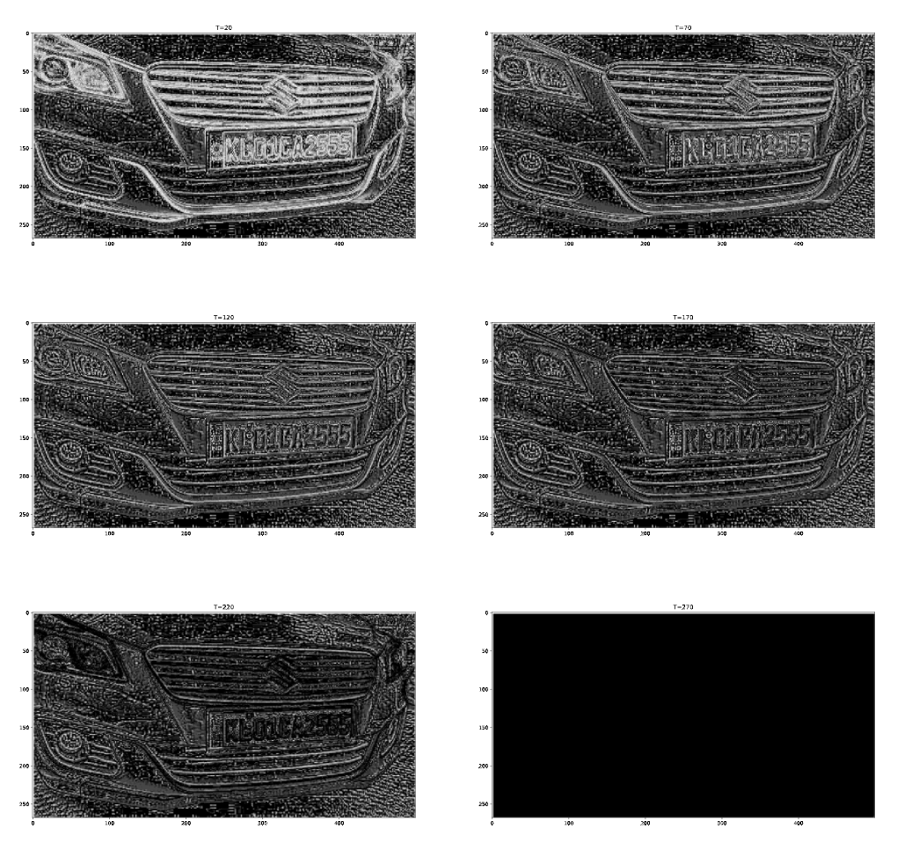
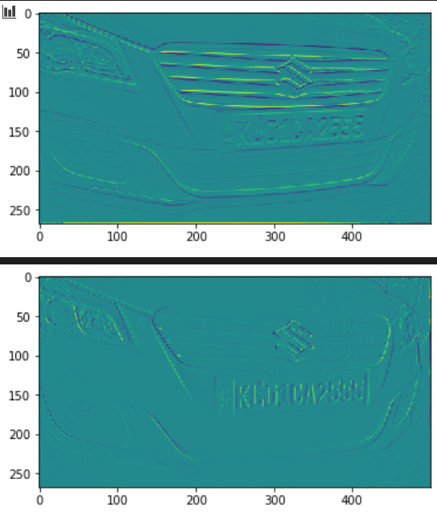
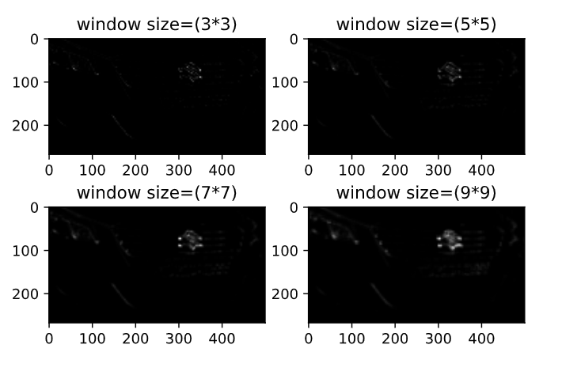
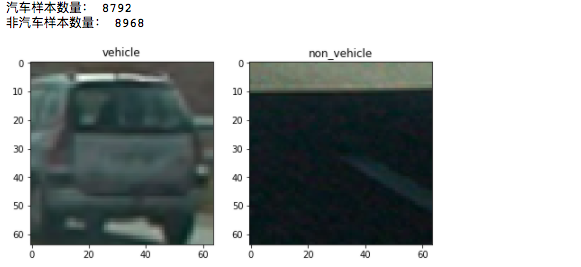
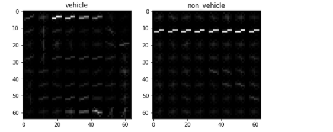
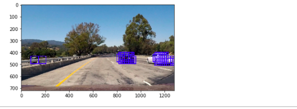
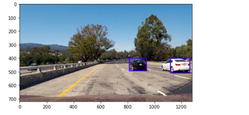
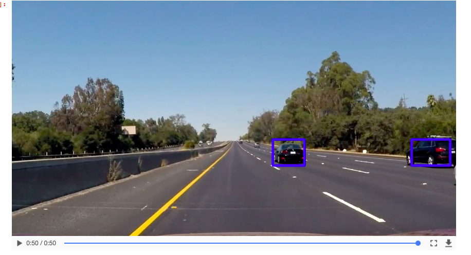
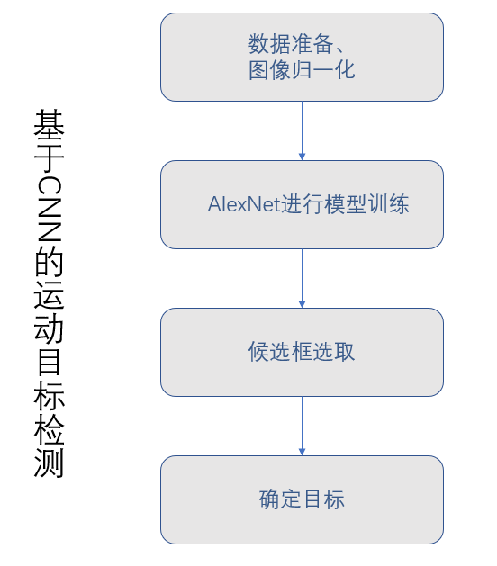
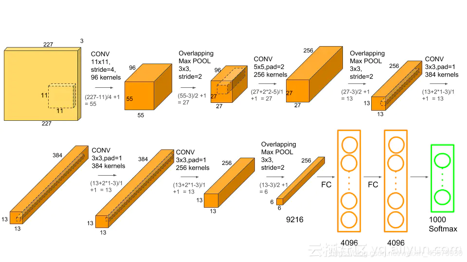

# [computer-vision](https://github.com/easilylazy/computer-vision)

人工智能与自动化学院18级计算机视觉大作业
- [computer-vision](#computer-vision)
  - [基元检测](#基元检测)
    - [SUSAN边缘点检测](#susan边缘点检测)
      - [实验效果](#实验效果)
    - [Harris角点检测](#harris角点检测)
      - [实验效果](#实验效果-1)
  - [车辆检测](#车辆检测)
    - [复现问题](#复现问题)
    - [算法流程](#算法流程)
  - [基于CNN](#基于cnn)
    - [数据准备、图像归一化](#数据准备图像归一化)
    - [模型选取](#模型选取)
    - [候选框选取](#候选框选取)
    - [问题：](#问题)
  - [帧间差分法](#帧间差分法)
    - [基本原理](#基本原理)
    - [算法流程](#算法流程-1)
  - [参考资料](#参考资料)
## 基元检测

### [SUSAN边缘点检测](susan.ipynb)
首先实现课程中的一个简单而实用的SUSAN特征提取
```py
def Susan(img,T=50,template=[]):
    i=2 # 5*5
    if len(template)==0:
        Smax=24
        G=3*Smax/4
    else:
        Smax=len(template[template==1])
        G=3*Smax/4

    R=np.zeros(grayImg.shape)
    for row in range(rows):
        for col in range(cols):
            # template
            
            center=grayImg[row][col]
            try:
                nucleus=grayImg[row-i:row+i+1,col-i:col+i+1]
                if len(template)!=0:
                    nucleus=nucleus[np.where(template)]
                # print(template[abs(template-center)>0.3])
                num=len(nucleus[abs(nucleus-center)<=T])
                if num<G:
                    R[row][col]=G-num
            except:
                pass
    return R
```
#### 实验效果  


上图是不同阈值T的结果，可见，随着T的增大，边缘逐渐减少，直至没有边缘点、角点检出，与理论情况一致。
### [Harris角点检测](harris.ipynb)
再利用Harris角点提取算法，找到图像中的角点关键点
```py
def Harris(img,i=2,k=0.04):
    R=np.zeros(grayImg.shape)
    size=2*i+1
    Ws=np.multiply(grayImg.reshape(grayImg.shape[0],grayImg.shape[1],1,1),H[:,:,])
    for row in range(rows):
        for col in range(cols):
            try:
                M=np.sum(Ws[row-i:row+i+1,col-i:col+i+1],axis=(0,1))
                R[row,col]=np.linalg.det(M)-k*np.trace(M)
            except:
                pass
    return R
```
#### 实验效果
这是不同方向的梯度图像：


 
通过梯度大小反映图像像素的变化情况，由此定位角点。
 

这是不同的窗口大小对角点检测结果的影响，可见在增大窗口大小时，得到的角点响应会更多。


## [车辆检测](hog.ipynb)

### 复现问题

1.	ValueError: setting an array element with a sequence.    
 因为更换了数据集，读入的数据集不一致，因此需要将图像进行裁剪处理
2.	TypeError: 'NoneType' object is not subscriptable   
cv的api更新，没有此前的图像代码
3.	ValueError: operands could not be broadcast together with shapes (1,8460) (27468,) (1,8460)   
由于训练使用的窗口不同，则得出的hog特征尺度不一致，调整为相同的32*32大小图像即可
### 算法流程

将会进行如下操作：

1. 定义图像特征提取方

2. 读入车辆和非车辆图像数据

3. 数据预处理，shuffle，标准化

4. 训练模型，使用的是svm

5. 测试模型

6. 使用滑动窗口和多尺度的图像大小在图像上检测车辆

   - 滑动窗口
   - 多尺度图像
   - heatmap
   - label
   - box center

7. 检测视频中行驶的车辆

   ​

**总结：车辆检测主要是两方面的内容，1:物体识别  2:滑动窗口** 


- 汽车和非汽车图片展示

  ```python
  import glob
  import matplotlib.pyplot as plt

  vehicle_lable = 1
  non_vehicle_label = 0

  # 读入数据
  vehicles_file_paths = glob.glob("./vehicles/*/*.png")
  non_vehicles_file_paths = glob.glob("./non-vehicles/*/*.png")
  print("汽车样本数量：" , len(vehicles_file_paths))
  print("非汽车样本数量：" , len(non_vehicles_file_paths))

  # 显示汽车和非汽车图片
  vehicle_img = mpimg.imread(vehicles_file_paths[0])
  non_vehicle_img = mpimg.imread(non_vehicles_file_paths[0])
  fig, (ax1, ax2) = plt.subplots(1, 2 ,figsize=(8, 20))
  ax1.imshow(vehicle_img)
  ax1.set_title("vehicle")
  ax2.imshow(non_vehicle_img)
  ax2.set_title("non_vehicle")
  plt.show()
  ```

  

- 提取HOG特征

  > hog参数说明：
  >
  > orientations：每个cell直方图的方向的个数
  >
  > pix_per_cell：每个cell像素个数
  >
  > cells_per_block：每个block的cell个数

  ```python
  import numpy as np
  import cv2
  import matplotlib.image as mpimg 

  def convert_color(img, conv):
      """
      颜色空间转换
      """
      return cv2.cvtColor(img, conv)

  def get_hog_features(img, orient, pix_per_cell, cell_per_block, vis=False, feature_vec=True):
      """
      提取图像的hog特征
      """
      if vis == True:
          features, hog_image = hog(img, orientations=orient, 
                                    pixels_per_cell=(pix_per_cell, pix_per_cell),
                                    cells_per_block=(cell_per_block, cell_per_block),
                                    block_norm= 'L2-Hys',
                                    transform_sqrt=False, 
                                    visualise=vis, feature_vector=feature_vec)
          return features, hog_image
      else:
          features = hog(img, orientations=orient, 
                         pixels_per_cell=(pix_per_cell, pix_per_cell),
                         cells_per_block=(cell_per_block, cell_per_block),
                         block_norm= 'L2-Hys',
                         transform_sqrt=False, 
                         visualise=vis, feature_vector=feature_vec)
          return features

  # 测试提取HOG特征
  vehicle_img = mpimg.imread(vehicles_file_paths[0])
  non_vehicle_img = mpimg.imread(non_vehicles_file_paths[0])
  v_hog_feats,v_hog_imgs = get_hog_features(vehicle_img[:, :, 0], 9, 8, 2, vis=True, feature_vec=False)
  n_hog_feats,n_hog_imgs = get_hog_features(non_vehicle_img[:, :, 0], 9, 8, 2, vis=True, feature_vec=False)

  # 显示汽车和非汽车图片
  vehicle_img = mpimg.imread(vehicles_file_paths[0])
  non_vehicle_img = mpimg.imread(non_vehicles_file_paths[0])
  fig, (ax1, ax2) = plt.subplots(1, 2 ,figsize=(8, 20))
  ax1.imshow(v_hog_imgs, cmap="gray")
  ax1.set_title("vehicle")
  ax2.imshow(n_hog_imgs, cmap="gray")
  ax2.set_title("non_vehicle")
  plt.show()
  ```

  

- 提取空间特征和颜色直方图特征，且把之上的特征进行合并。

  ```python
  def bin_spatial(img, size=(32, 32)):
      """
      提取图像的空间特征
      """
      color1 = cv2.resize(img[:,:,0], size).ravel()
      color2 = cv2.resize(img[:,:,1], size).ravel()
      color3 = cv2.resize(img[:,:,2], size).ravel()
      return np.hstack((color1, color2, color3))

  def color_hist(img, nbins=32):
      """
      颜色直方图
      """
      channel1_hist = np.histogram(img[:,:,0], bins=nbins)
      channel2_hist = np.histogram(img[:,:,1], bins=nbins)
      channel3_hist = np.histogram(img[:,:,2], bins=nbins)
      hist_features = np.concatenate((channel1_hist[0], channel2_hist[0], channel3_hist[0]))
      return hist_features

  def extract_img_features(img):
      """
      把之上的图像处理方法进行综合，且对结果进行归一化处理
      """
      img = cv2.cvtColor(img, cv2.COLOR_RGB2YCrCb)
      hist_feature = color_hist(img)
      spatial_feature = bin_spatial(img)
      ch1 = img[:, :, 0]
      ch2 = img[:, :, 1]
      ch3 = img[:, :, 2]
      ch1_hog_feature = get_hog_features(ch1, 9, 8, 2)
      ch2_hog_feature = get_hog_features(ch2, 9, 8, 2)
      ch3_hog_feature = get_hog_features(ch3, 9, 8, 2)
      hog_features = np.hstack((ch1_hog_feature, ch2_hog_feature, ch3_hog_feature))
      features = np.concatenate((hist_feature, spatial_feature, hog_features))
      return features
  ```

- 根据上边的图像特征提取方法，对所有的数据进行特征提取

  ```python
  X = []
  y = []
  for path in vehicles_file_paths:
      img = mpimg.imread(path)
      features = extract_img_features(img)
      X.append(features)
      y.append(vehicle_lable)

  for path in non_vehicles_file_paths:
      img = mpimg.imread(path)
      features = extract_img_features(img)
      X.append(features)
      y.append(non_vehicle_label)
  ```

- 数据预处理

  > shuffle —> train_test_split—>StandardScaler
  >
  > 注意：数据标准化的时候，使用训练数据作为fit的对象。

  ```python
  from skimage.feature import hog
  from sklearn.model_selection import train_test_split
  from sklearn.utils import shuffle
  from sklearn.preprocessing import StandardScaler

  # shuffle
  X, y = shuffle(X, y)
  # split
  rand_state = np.random.randint(0, 100)
  X_train, X_test, y_train, y_test = train_test_split(X, y, test_size=0.2, random_state=rand_state)
  # scaller
  X_scaler = StandardScaler().fit(X_train)
  X_train = X_scaler.transform(X_train)
  X_test = X_scaler.transform(X_test)
  ```

- 训练模型

  ```python
  from sklearn.svm import LinearSVC

  svm = LinearSVC()
  svm.fit(X_train, y_train)
  ```

- 测试模型

  > 最后模型的准确率为：0.986204954955

  ```python
  from sklearn.metrics import accuracy_score

  predicts = svm.predict(X_test)
  score = accuracy_score(predicts, y_test)
  print("在测试数据上的准确率为：" + score)
  ```

- 从图片中检测汽车

  > **滑动窗口技术是关键**
  >
  > 因为不知道检测物体的大小，远的地方车辆看起来小，近的地方看起来大。为了得到合适的检测数据，需要图片进行适当的缩放。但是这样带来的后果是，计算量会急剧增加。可以采查找车辆只在图像的下半部分，因为上半部分是天空。为了提高效率，先对整幅图像进行HOG特征提取，然后再根据需要进行特征分割。

  ```python
  def find_cars(img, ystart, ystop, scale, svc, X_scaler, orient, pix_per_cell, cell_per_block, spatial_size, hist_bins):
      """
      检测当前图像中的所有可能的汽车位置
      """
      
      boxs = []
      draw_img = np.copy(img)
      img = img.astype(np.float32)/255
      
      img_tosearch = img[ystart:ystop,:,:]
      ctrans_tosearch = cv2.cvtColor(img_tosearch, cv2.COLOR_RGB2YCrCb)
      if scale != 1:
          imshape = ctrans_tosearch.shape
          ctrans_tosearch = cv2.resize(ctrans_tosearch, (np.int(imshape[1]/scale), np.int(imshape[0]/scale)))
          
      ch1 = ctrans_tosearch[:,:,0]
      ch2 = ctrans_tosearch[:,:,1]
      ch3 = ctrans_tosearch[:,:,2]

      # Define blocks and steps as above
      nxblocks = (ch1.shape[1] // pix_per_cell) - cell_per_block + 1
      nyblocks = (ch1.shape[0] // pix_per_cell) - cell_per_block + 1 
      nfeat_per_block = orient*cell_per_block**2
      
      # 64 was the orginal sampling rate, with 8 cells and 8 pix per cell
      window = 64
      nblocks_per_window = (window // pix_per_cell) - cell_per_block + 1
      cells_per_step = 2  # Instead of overlap, define how many cells to step
      nxsteps = (nxblocks - nblocks_per_window) // cells_per_step + 1
      nysteps = (nyblocks - nblocks_per_window) // cells_per_step + 1
      
      # Compute individual channel HOG features for the entire image
      hog1 = get_hog_features(ch1, orient, pix_per_cell, cell_per_block, feature_vec=False)
      hog2 = get_hog_features(ch2, orient, pix_per_cell, cell_per_block, feature_vec=False)
      hog3 = get_hog_features(ch3, orient, pix_per_cell, cell_per_block, feature_vec=False)
      
      for xb in range(nxsteps):
          for yb in range(nysteps):
              ypos = yb*cells_per_step
              xpos = xb*cells_per_step
              # Extract HOG for this patch
              hog_feat1 = hog1[ypos:ypos+nblocks_per_window, xpos:xpos+nblocks_per_window].ravel() 
              hog_feat2 = hog2[ypos:ypos+nblocks_per_window, xpos:xpos+nblocks_per_window].ravel() 
              hog_feat3 = hog3[ypos:ypos+nblocks_per_window, xpos:xpos+nblocks_per_window].ravel() 
              hog_features = np.hstack((hog_feat1, hog_feat2, hog_feat3))

              xleft = xpos*pix_per_cell
              ytop = ypos*pix_per_cell

              # Extract the image patch
              subimg = cv2.resize(ctrans_tosearch[ytop:ytop+window, xleft:xleft+window], (64,64))
            
              # Get color features
              spatial_features = bin_spatial(subimg, size=spatial_size)
              hist_features = color_hist(subimg, nbins=hist_bins)

              # Scale features and make a prediction
              test_features = X_scaler.transform(np.hstack((hist_features, spatial_features, hog_features)).reshape(1, -1))    
              #test_features = X_scaler.transform(np.hstack((shape_feat, hist_feat)).reshape(1, -1))    
              test_prediction = svc.predict(test_features)
              if test_prediction == 1:
                  xbox_left = np.int(xleft*scale)
                  ytop_draw = np.int(ytop*scale)
                  win_draw = np.int(window*scale)
                  boxs.append([(xbox_left, ytop_draw+ystart),(xbox_left+win_draw,ytop_draw+win_draw+ystart)])
      return boxs

  img = mpimg.imread("test_images/test1.jpg")
  boxs = find_cars(img, 400, 600, 1, svm, X_scaler, 9, 8, 2, (32, 32), 32)
  for box in boxs:
      cv2.rectangle(img, box[0], box[1], (0, 0, 255), 6)
  plt.imshow(img)
  plt.show()
  ```

  

- 使用heatmap去掉错误检测的数据

  > 错误检测的数据出现的频率不高，根据频率去掉低频率的数据点，保留高频率的数据点。

  ```python
  # 创建热度图
  heatmap = np.zeros_like(img[:, :, :]).astype(np.float)
  for box in boxs:
      heatmap[box[0][1]:box[1][1], box[0][0]:box[1][0], 0] += 1
  fig,(ax1, ax2) = plt.subplots(1, 2, figsize=(15, 20))
  ax1.imshow(heatmap)
  ax1.set_title("heatmap")
  heatmap[heatmap < 3] = 0 
  ax2.imshow(heatmap)
  ax2.set_title("heatmap_filted")
  plt.show()
  ```

  

- 使用label把检测到的区域外接矩形框。

  ```python
  from scipy.ndimage.measurements import label

  labels = label(heatmap)
  for car_number in range(1, labels[1] + 1):
      nonzero = (labels[0] == car_number).nonzero()
      nonzeroy = np.array(nonzero[0])
      nonzerox = np.array(nonzero[1])
      bbox = ((np.min(nonzerox), np.min(nonzeroy)), (np.max(nonzerox), np.max(nonzeroy)))
      cv2.rectangle(img, bbox[0], bbox[1], (0, 0, 255), 6)
     
  fig,ax1 = plt.subplots(1, 1, figsize=(7, 12))
  ax1.imshow(img)
  plt.show()
  ```

  

- 设置中心点检测判断

  > 每检测完一幅图像，记录一下在该图像中检测到的矩形框的中心点。下次检测到的矩形框判断是否有中心点在其中。这样可以减少错误的判断。

  ```python
  box_center = []
  def detect_object(img):
      
      bbox_list = []
      # 分别对各个尺度的窗口查找汽车的位置
      boxs = find_cars(img, 400, 656, 1.2, svm, X_scaler, 9, 8, 2, (32, 32), 32)
      bbox_list = bbox_list + boxs
      boxs = find_cars(img, 400, 600, 1, svm, X_scaler, 9, 8, 2, (32, 32), 32)
      bbox_list = bbox_list + boxs
      boxs = find_cars(img, 400, 500, 0.8, svm, X_scaler, 9, 8, 2, (32, 32), 32)
      bbox_list = bbox_list + boxs
      # 创建热度图
      heatmap = np.zeros_like(img[:, :, 0]).astype(np.float)
      for box in bbox_list:
          heatmap[box[0][1]:box[1][1], box[0][0]:box[1][0]] += 1
      # 排除掉出现频率小的汽车检测位置
      heatmap[heatmap <=8] = 0
      # 对汽车的位置进行标记，画矩形
      labels = label(heatmap)
      for car_number in range(1, labels[1] + 1):
          nonzero = (labels[0] == car_number).nonzero()
          nonzeroy = np.array(nonzero[0])
          nonzerox = np.array(nonzero[1])
          bbox = ((np.min(nonzerox), np.min(nonzeroy)), (np.max(nonzerox), np.max(nonzeroy)))
          if len(box_center) > 0:
              for center in box_center:
                  if bbox[0][0]  < center[0] < bbox[1][0]  and bbox[0][1] < center[1] < bbox[1][1]:
                      cv2.rectangle(img, bbox[0], bbox[1], (0, 0, 255), 6)
                      break
          box_center.append(((bbox[0][0]+bbox[1][0] )/2, (bbox[0][1] + bbox[1][1])/2))
      return img
  ```

- 处理视频中的车辆检测

  ```python
  from moviepy.editor import VideoFileClip

  clip1 = VideoFileClip("project_video.mp4")
  white_clip = clip1.fl_image(detect_object)
  #white_clip.write_images_sequence("test_challenge/frame%2d.jpg")
  white_clip.write_videofile("project_video_output.mp4", audio=False)
  ```

- 展示，视频地址 [点这里](project_video_output.mp4)

  ```python
  from IPython.display import HTML

  HTML("""
  <video width="960" height="540" controls>
    <source src="{0}">
  </video>
  """.format("project_video_output.mp4"))
  ```

  
## [基于CNN](vehicle.ipynb)

### 数据准备、图像归一化
因为AlexNet的输入为224*224，所以我们先将64*64图像resize到224*224，其中插值方式我们选取的是双线性插值。
	由于电脑显存原因，我们只使用了1000个正样本，1000个负样本进行训练。
（否则会出现CUDA内存不足的错误）
### 模型选取
选取AlexNet，它在图像分类中的表现很突出





训练完成，在测试集上能达到85%的精度。
### 候选框选取
1.	滑动窗口：
通过一个矩形窗在图片上运动，将图片切割成一个个矩形图片，为避免漏掉一些特征，矩形窗有重复。
2.	利用模型判断是否为车:
将滑动窗口截取到的图片输入到模型，根据输出判断是否为车。

### 问题：
1、	Q：如果只是简单的滑动窗口，那么窗口大小该如何选择？
A：我们可以采用近大远小的原理进行矩形窗的设计，让处在图像上方的搜索框小一些，下方的搜索框大一些。
2、	Q：如何解决一台车被多个搜索框检测到的情况？
A：我们可以建立投票制度，将每个框在图像上进行投票，如果这个框被模型判断为车，那么在这个区域就加上一票，最后设定阈值，输出高于阈值的框。


## [帧间差分法](zhen.ipynb)

### 基本原理
 帧间差分法是一种通过对视频图像序列的连续两帧图像做差分运算获取运动目标轮廓的方法。当监控场景中出现异常目标运动时，相邻两帧图像之间会出现较为明显的差别，两帧相减，求得图像对应位置像素值差的绝对值，判断其是否大于某一阈值，进而分析视频或图像序列的物体运动特性
### 算法流程
1.	由I(t)和I(t-1)得到前景图像D1
2.	由I(t+1)和I(t)得到前景图像D2
3.	D=D1∩D2得到最终前景图像
4.	形态学处理

## 参考资料

- [深入理解AlexNet网络](https://blog.csdn.net/luoluonuoyasuolong/article/details/81750190)
- [Vehicle-Detection](https://github.com/tonyxxq/Vehicle-Detection)
- [opencv python 三帧差法实现运动目标区域检测与完整代码](https://blog.csdn.net/pengpengloveqiaoqiao/article/details/89487049)